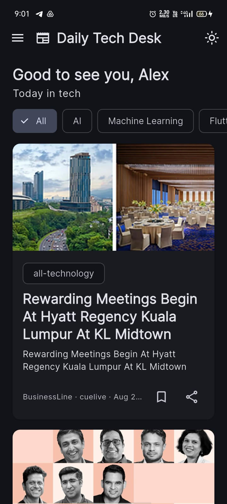
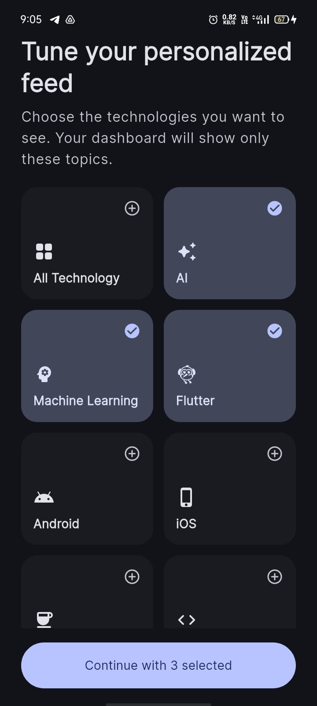
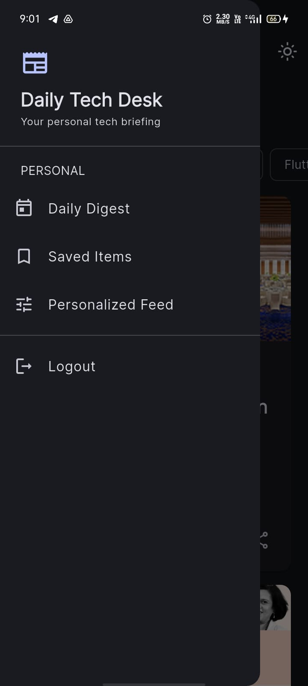
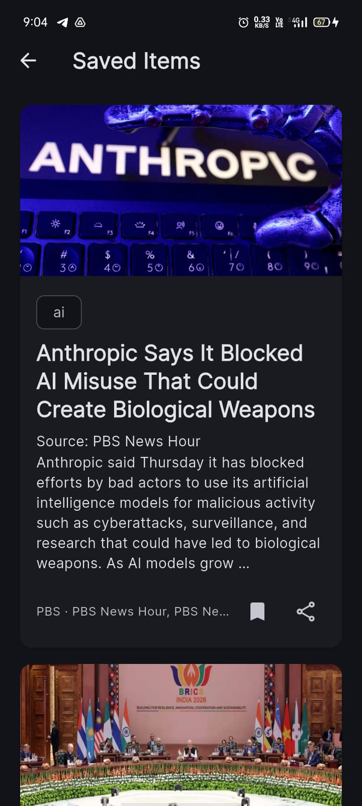

# 📱 Daily Tech Desk

A personal technology news desk for students and developers — built with **Flutter**, **ASP.NET Core**, **PostgreSQL (Supabase)**, and **NewsAPI**.


🔗 **Live Demo:** [your-demo-link-here](#)

---

## 🎥 Demo

<!-- Replace with your actual video link, or an embedded GIF -->
[](https://your-video-link-here)

## 📸 Screenshots

<p align="center">
  
  
  
</p>
<p align="center">
  
  
  
</p>

---

## 🎯 About

Daily Tech Desk gives students and developers a personalized technology feed — covering AI/ML, Flutter, programming, cloud, cybersecurity, DevOps, big tech, startups, open source, and web development — instead of requiring manual searching.

---

## 🛠 Tech Stack

**Frontend:** Flutter, Dart, BLoC/Cubit, GoRouter, Dio, SharedPreferences
**Backend:** ASP.NET Core (.NET 10), Entity Framework Core, Npgsql
**Database:** PostgreSQL (Supabase)
**External API:** NewsAPI
**Deployment:** Render (API) · Supabase (DB)

---

## 🏗 Architecture

```text
Flutter App  --HTTPS-->  ASP.NET Core API (Render)  --->  PostgreSQL (Supabase)
                                                    --->  NewsAPI
```

The NewsAPI key stays server-side — the Flutter app never accesses it directly.

---

## ✨ Features

- Personalized technology feed with category filtering
- Daily Digest of the day's top tech news
- Bookmark / save articles (persisted locally via `SharedPreferences`)
- Offline access to saved articles
- Share & open original article links
- Light/dark theme support

---

## 🔌 API Endpoints

| Method | Endpoint | Description |
|---|---|---|
| `GET` | `/api/articles` | Paginated technology articles |
| `GET` | `/api/articles/{category}` | Articles filtered by category |
| `GET` | `/api/articles/daily-digest` | Today's technology digest |

All support `?page=1&pageSize=20` pagination.

---

## 💻 Running Locally

**Backend**
```bash
dotnet restore
dotnet run
```
Set your PostgreSQL connection string via user secrets:
```bash
dotnet user-secrets set "ConnectionStrings:DefaultConnection" "Host=...;Database=...;Username=...;Password=..."
```

**Flutter**
```bash
flutter pub get
flutter run
```
Point `app_config.dart` to your local API URL (development only) or the deployed Render URL (production).

---

## 📊 Status

| Component | Status |
|---|---|
| Frontend / Backend / DB | ✅ Done |
| NewsAPI integration | ✅ Done |
| Daily Digest & Saved Items | ✅ Done |
| Deployment (Render) | 🔄 In progress |
| Play Store publishing | ⏳ Next |

---

<p align="center">Built with ❤️ using Flutter, ASP.NET Core, PostgreSQL & Supabase.</p>